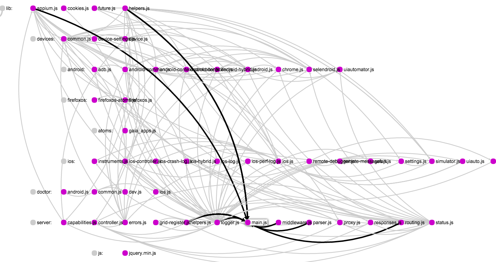

### Figure out relations between your js files(thorgh `require()` and `import`)

### Example： Appium code:

### Usage

1. Open terminal
2. Install the package: `npm install -g js-code-structure`
3. Go to the directory of your project
4. Input `jss`

**then a html file describing the relations of your the js files will show up**

### Advanced Usage:

1. Ignore some directory inside the directory:

    `jss --ignore dirname1 dirname2 dirname3 ...`

    > these dirs are ignored by default: `['node_modules', '.git', 'dist', 'build', 'doc', 'test', 'submodules']`
2. Show required files: hover on the node
3. Show being required files: click the node

### Tools

[sigma.js](http://sigmajs.org/)

### Thanks：

- [command line tool](http://jslite.io/2015/06/19/Nodejs-%E5%88%B6%E4%BD%9C%E5%91%BD%E4%BB%A4%E8%A1%8C%E5%B7%A5%E5%85%B7/)
- [directory traversal](http://swordair.com/directory-traversal-in-nodejs/)

### License
MIT

[![paypal donate][paypal-image]][paypal-url]
[paypal-image]: https://www.paypal.com/en_US/i/btn/btn_donate_SM.gif
[paypal-url]: https://www.paypal.com/cgi-bin/webscr?cmd=_xclick&business=timqian92@qq.com&currency_code=USD&amount=1&return=https://github.com/timqian&item_name=timqian&undefined_quantity=1&no_note=0
