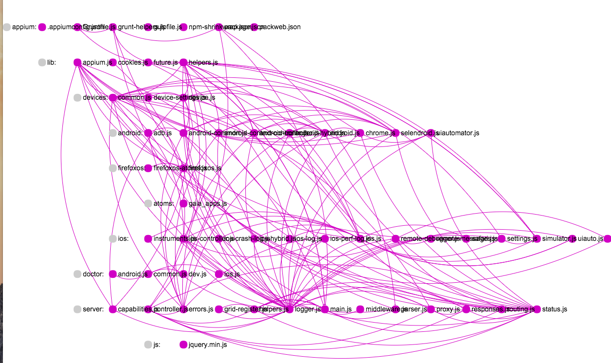

## Analyse the structure of your js project

Figure out relations between your js files(thorgh `require()`)

## Usage

1. open terminal
2. install the package: `npm install -g js-code-structure`
2. Go to the directory of the project
3. input `jss` and hit enter
**then a html file describing the relations of your the js files will show up in the directory**

## Example： Appium code:

## 参考资料：

- [开发成命令行工具](http://jslite.io/2015/06/19/Nodejs-%E5%88%B6%E4%BD%9C%E5%91%BD%E4%BB%A4%E8%A1%8C%E5%B7%A5%E5%85%B7/)
- [node 目录遍历](http://swordair.com/directory-traversal-in-nodejs/)
